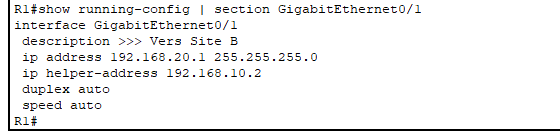
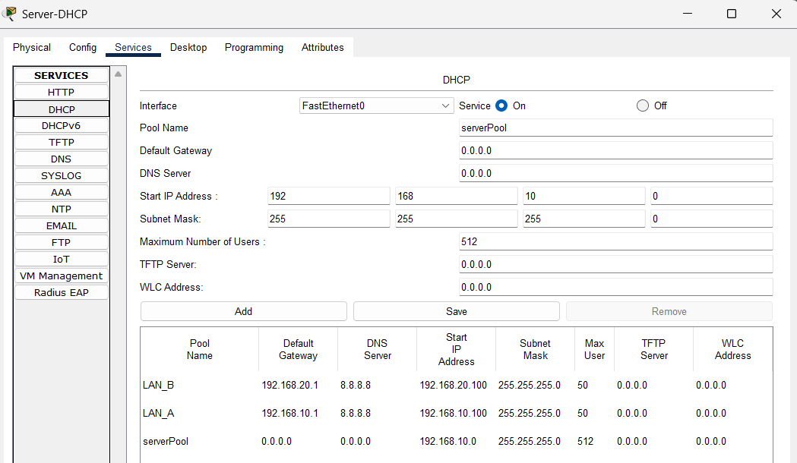
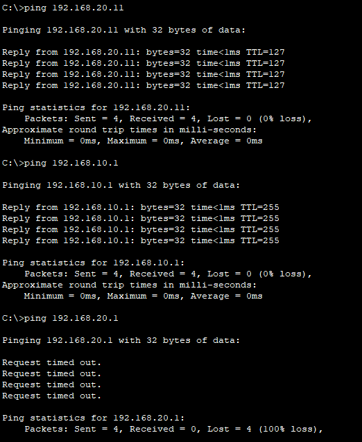
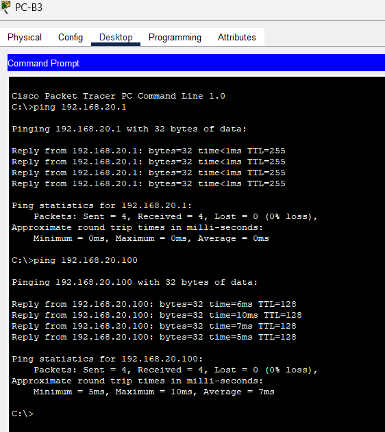

# 🧩 Exercice 2 – Projet SOHO : Mise en place d’un serveur DHCP centralisé

## 🎯 Objectif de l’exercice

Mettre en place un **serveur DHCP centralisé** sur le **Site A**, permettant d’attribuer automatiquement des adresses IP aux postes de **deux réseaux locaux (LAN)** :

- Le **LAN_A** (Site A)
- Le **LAN_B** (Site B)

L’interconnexion entre les deux réseaux est assurée par un **routeur Cisco 1941** configuré en relais DHCP grâce à la commande `ip helper-address`.

---

## 🧱 Topologie réseau

```

[PC-A1, PC-A2, PC-A3] -- SwitchA -- (G0/0) Routeur R1 (G0/1) -- SwitchB -- [PC-B1, PC-B2, PC-B3]
|
+-- Serveur DHCP (192.168.10.2)

```

### Détails :

- **Site A :** 192.168.10.0 /24
- **Site B :** 192.168.20.0 /24
- **Routeur R1 :**
  - G0/0 → 192.168.10.1
  - G0/1 → 192.168.20.1
  - Relais DHCP activé sur G0/1 (`ip helper-address 192.168.10.2`)

---

## ⚙️ Configuration du serveur DHCP (Site A)

### Adresse IP du serveur

| Élément         | Valeur        |
| --------------- | ------------- |
| IP Address      | 192.168.10.2  |
| Subnet Mask     | 255.255.255.0 |
| Default Gateway | 192.168.10.1  |
| DNS Server      | 8.8.8.8       |

### Pools DHCP configurés

| Pool  | Réseau          | Passerelle   | Plage d’adresses                | Max Users |
| ----- | --------------- | ------------ | ------------------------------- | --------- |
| LAN_A | 192.168.10.0/24 | 192.168.10.1 | 192.168.10.100 – 192.168.10.149 | 50        |
| LAN_B | 192.168.20.0/24 | 192.168.20.1 | 192.168.20.100 – 192.168.20.149 | 50        |

💡 Le serveur DHCP se trouve sur le **Site A**, mais attribue aussi des adresses au **Site B** grâce au relais sur le routeur.

---

## 🖧 Configuration du routeur R1

### Extraits de configuration

```bash
interface GigabitEthernet0/0
 description >>> Vers Site A
 ip address 192.168.10.1 255.255.255.0
 no shutdown

interface GigabitEthernet0/1
 description >>> Vers Site B
 ip address 192.168.20.1 255.255.255.0
 ip helper-address 192.168.10.2
 no shutdown
```

---

## 🧪 Vérifications et tests

### Test 1 : Attribution automatique d’adresse IP

Chaque PC a été configuré en mode **DHCP** :

- Les PC du **Site A** ont reçu une IP dans la plage `192.168.10.100+`
- Les PC du **Site B** ont reçu une IP dans la plage `192.168.20.100+`

✅ Vérification dans le serveur → _Services > DHCP > Bindings_ :
Les baux sont bien enregistrés pour chaque machine.

---

### Test 2 : Connectivité entre les deux sites

Ping depuis un poste du Site A vers un poste du Site B :

```
PC-A1> ping 192.168.20.100
Reply from 192.168.20.100: bytes=32 time<1ms TTL=128
```

✅ Résultat : **connectivité opérationnelle entre les deux LAN via le routeur**.

---

## 🗂️ Livrables

Le fichier `.pkt` contient la topologie complète de l’exercice.
Il peut être ouvert avec **Cisco Packet Tracer** version 8.x ou supérieure.

- [Theo_FRANCOIS_Ex2_SOHO.pkt](Theo_FRANCOIS_Ex2_SOHO.pkt)
- Ce document : `README_Exercice2_DHCP.md`
- Captures d’écran :

  - Configuration du serveur DHCP (pools + bindings)
  - Ping réussi entre Site A et Site B

---

## 📸 Captures d’écran

### 🧩 Configuration du routeur



### 🧩 Configuration du serveur DHCP



### 📡 Pings entre les PC du Site A



### 📡 Pings entre les PC du Site B



---

## 🧠 Conclusion

L’infrastructure mise en place permet :

- Une **attribution automatique** d’adresses IP sur les deux sites,
- Une **gestion centralisée** du DHCP depuis le Site A,
- Une **communication fluide** entre les deux sous-réseaux via le routeur.

---

_Auteur : Théo FRANCOIS_
_Formation : Wild Code School – TSSR_
_Date : 09/10/2025_
