# 🌐 Exercice 3 — Déploiement d’un Serveur Windows (AD, DHCP, DNS, Partages)

## 🎯 Objectif de la mission

Mettre en place un serveur Windows Server 2019 au sein du réseau de l’entreprise **Rue25**, permettant :

- La gestion centralisée des utilisateurs via **Active Directory (AD DS)** ;
- L’attribution automatique d’adresses IP via **DHCP** ;
- La résolution de noms grâce à **DNS** ;
- Le partage sécurisé de dossiers entre les services (NTFS + groupes AD).

---

## 🖥️ 1. Installation et configuration du serveur

Le serveur virtuel a été déployé sous **Oracle VirtualBox** avec les paramètres suivants :

- **Nom :** `SRV-DC1`
- **Système d’exploitation :** Windows Server 2019 (64 bits)
- **Mémoire vive :** 4 Go
- **Disque :** 60 Go (VDI)
- **Réseau :** Interne (`Rue25LAN`)

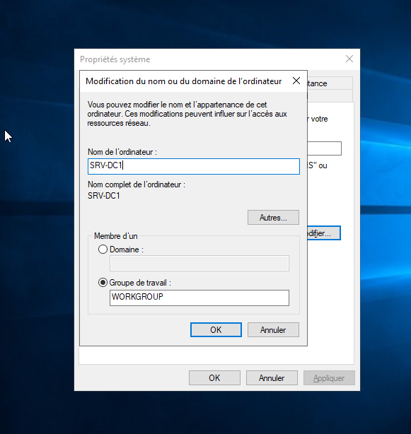

---

## 🧱 2. Installation des rôles AD DS, DNS et DHCP

Depuis le **Gestionnaire de serveur**, les rôles suivants ont été ajoutés :

- **Active Directory Domain Services (AD DS)**
- **DNS Server**
- **DHCP Server**

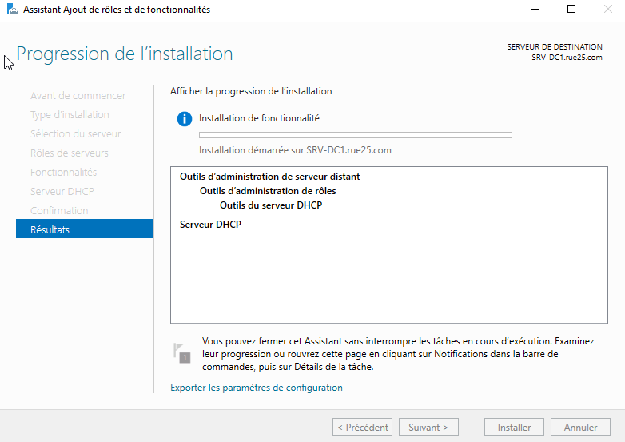
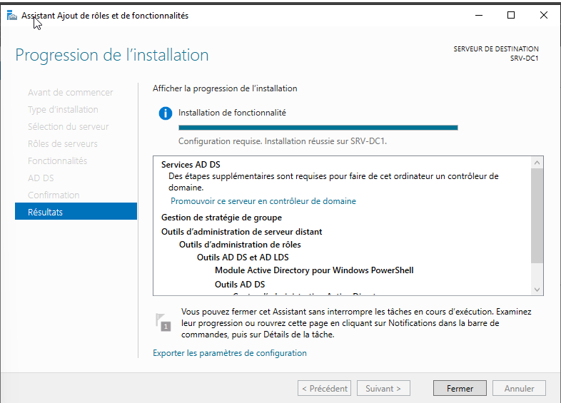


Une fois l’installation terminée, le serveur a été promu **contrôleur de domaine** sous le nom :

```

rue25.com

```

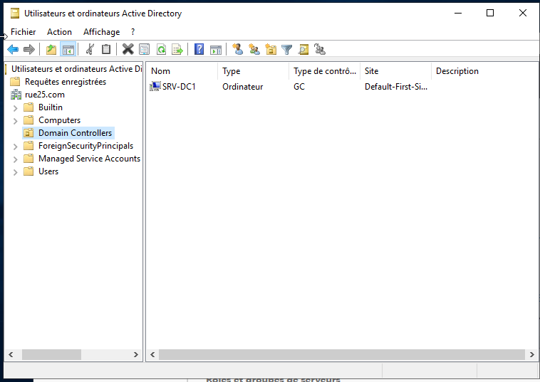

---

## 📡 3. Configuration du service DHCP

### Création d’une étendue

Une étendue DHCP a été créée pour distribuer automatiquement les adresses IP :

| Paramètre  | Valeur                          |
| ---------- | ------------------------------- |
| Plage IP   | 192.168.25.100 → 192.168.25.200 |
| Masque     | 255.255.255.0                   |
| Passerelle | 192.168.25.1                    |
| DNS        | 192.168.25.10                   |
| Domaine    | rue25.com                       |

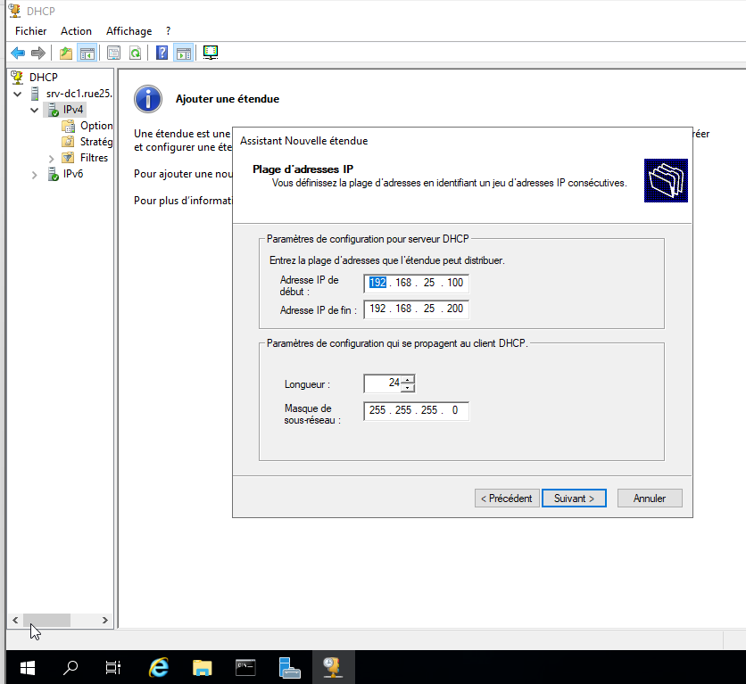
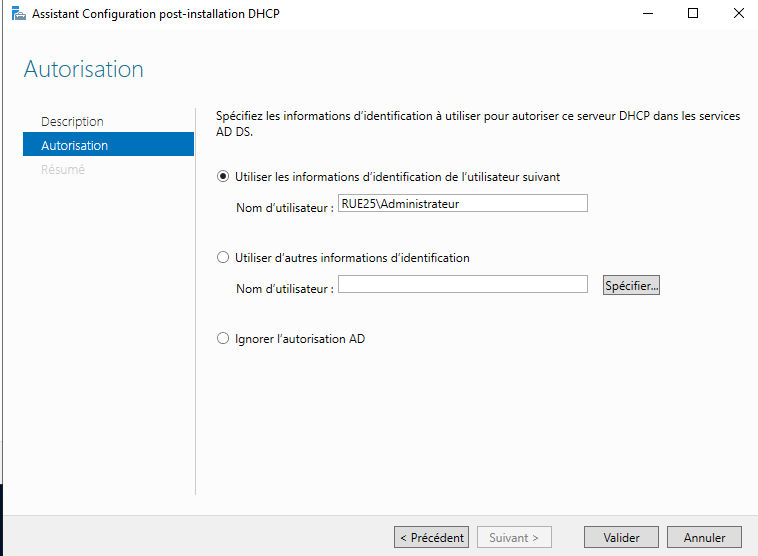

---

### Test DHCP côté client

Une machine virtuelle **Windows 10 (Client-W10)** a été configurée sur le même réseau interne `Rue25LAN`.  
Après redémarrage, la commande `ipconfig /all` montre bien une attribution automatique :

```bash
Adresse IPv4 : 192.168.25.100
Masque de sous-réseau : 255.255.255.0
Serveur DHCP : 192.168.25.10
Serveur DNS : 192.168.25.10
Domaine : rue25.com
```

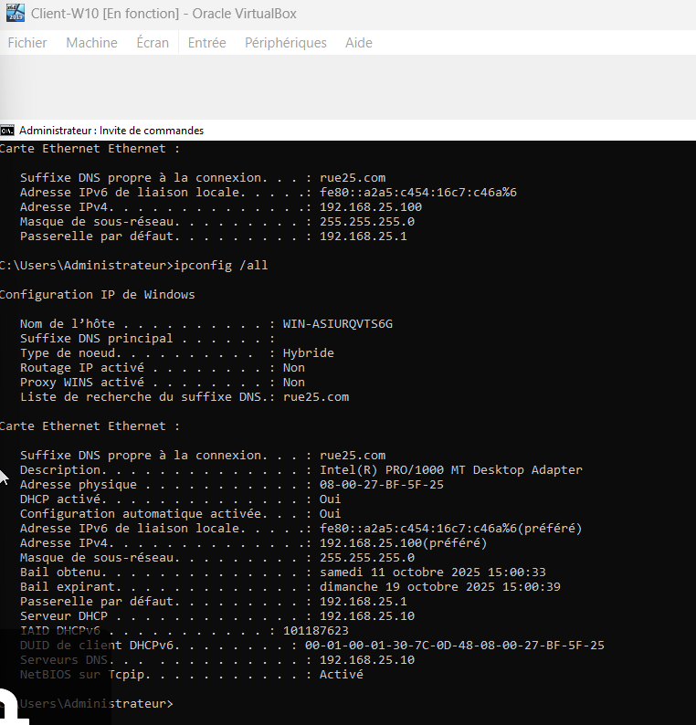

✅ Le serveur DHCP fonctionne et distribue les adresses du domaine.

---

## 🧑‍💼 4. Configuration de l’Active Directory

### Création des Unités d’Organisation (OU)

L’annuaire a été organisé en quatre services :

```
rue25.com
├── Direction
├── Consultants
├── Commerciaux
└── Comptables
```

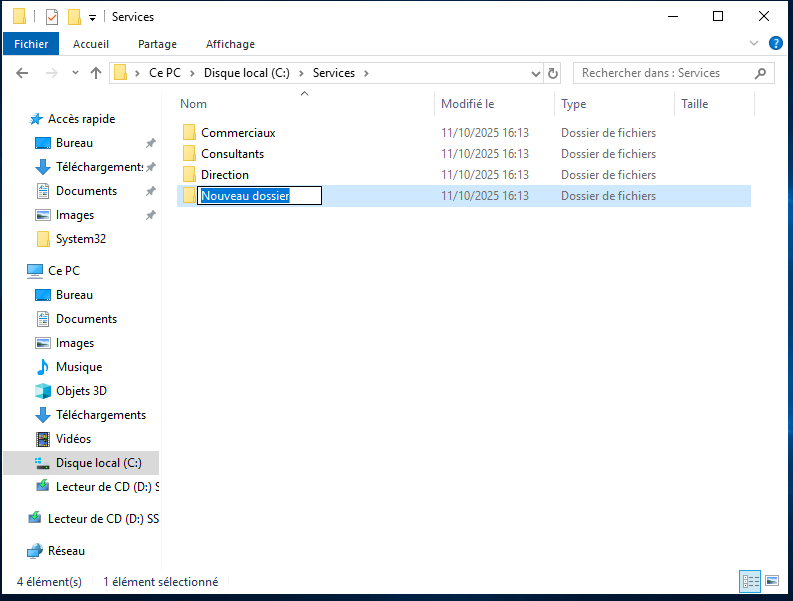

---

### Création des groupes de sécurité

Chaque service dispose de son **groupe AD** :

| Service     | Groupe AD     | Type     | Étendue |
| ----------- | ------------- | -------- | ------- |
| Direction   | G_Direction   | Sécurité | Globale |
| Consultants | G_Consultants | Sécurité | Globale |
| Commerciaux | G_Commerciaux | Sécurité | Globale |
| Comptables  | G_Comptables  | Sécurité | Globale |

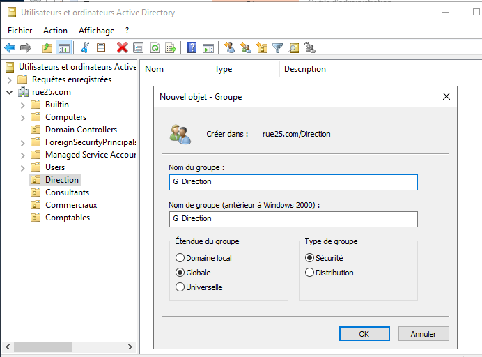

---

### Création des utilisateurs Rue25

Tous les collaborateurs de Rue25 ont été ajoutés à leur service :

| Utilisateur        | Service                | Identifiant | Groupe        |
| ------------------ | ---------------------- | ----------- | ------------- |
| Samira Bien        | Direction (Directrice) | sbien      | G_Direction   |
| Sylvie Bien        | Direction              | sbien2       | G_Direction   |
| Lisa Razou         | Direction              | lrazou      | G_Direction   |
| Alain Firmerie     | Consultants            | afirmerie   | G_Consultants |
| Mehdi Tez          | Consultants            | mtez        | G_Consultants |
| Jonathan Longtemps | Commerciaux            | jlongtemps  | G_Commerciaux |
| Paul Dunor         | Commerciaux            | pdunor      | G_Commerciaux |
| Vincent Tyme       | Comptables             | vtyme       | G_Comptables  |
| Cyrène Demer       | Comptables             | cdemer      | G_Comptables  |

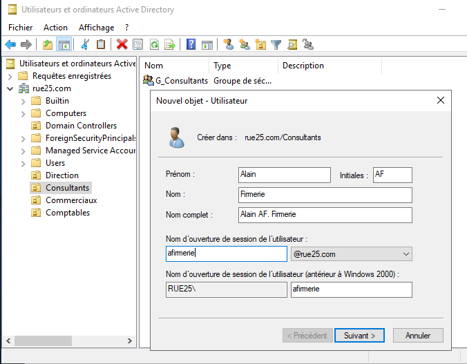
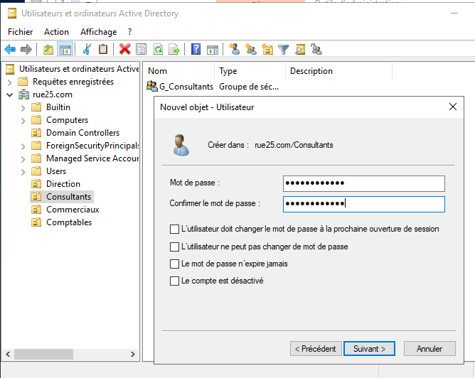

---

## 📂 5. Mise en place des dossiers partagés

Chaque service dispose d’un dossier sécurisé sur le serveur :

```
C:\Services\
├── Direction
├── Consultants
├── Commerciaux
└── Comptables
```

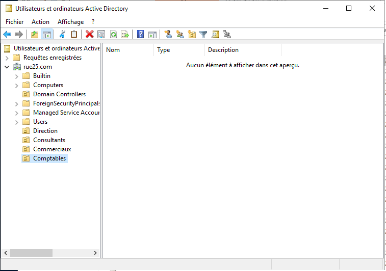

---

### Configuration des droits NTFS

Les droits d’accès ont été configurés selon le tableau de consignes Simplon :

| Dossier     | Accès en édition | Accès en lecture seule |
| ----------- | ---------------- | ---------------------- |
| Direction   | G_Direction      | —                      |
| Consultants | G_Consultants    | Samira                 |
| Commerciaux | G_Commerciaux    | G_Comptables + Samira  |
| Comptables  | G_Comptables     | Samira                 |

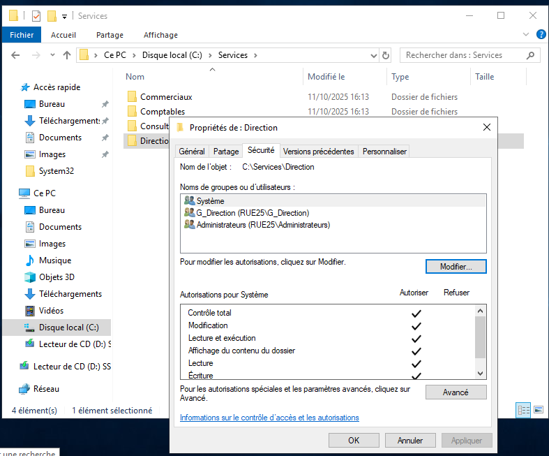
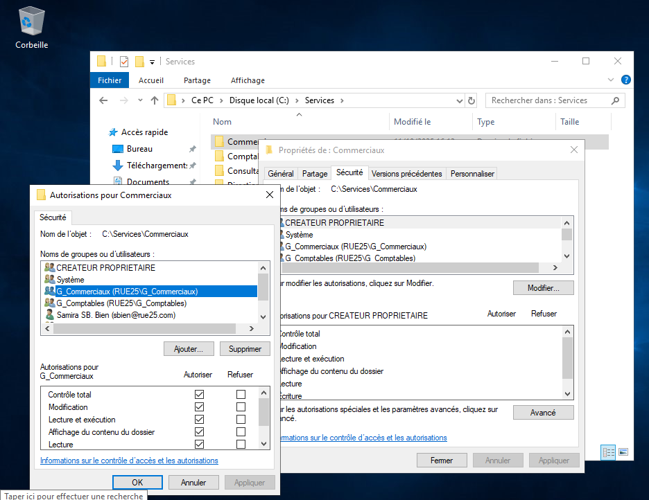
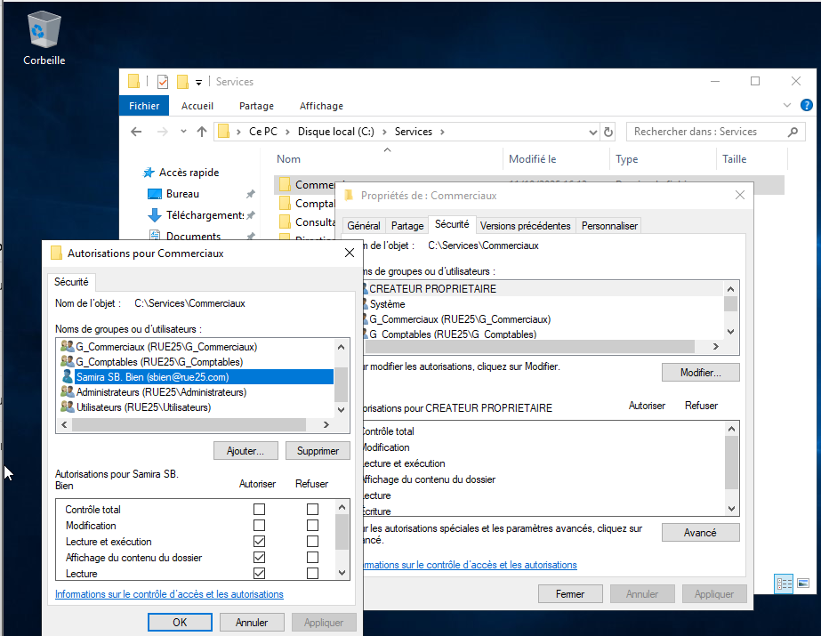

Chaque dossier a l’héritage **désactivé**, puis les permissions NTFS ont été appliquées manuellement :

- **Contrôle total** pour le groupe du service ;
- **Lecture seule** pour les services ou utilisateurs autorisés.

---

### Vérification des accès

Depuis le poste client :

- Un utilisateur du groupe **G_Commerciaux** peut modifier le dossier `\\SRV-DC1\Commerciaux$` mais pas accéder aux autres.
- La **Directrice (Samira Bien)** peut ouvrir en lecture les dossiers `Consultants`, `Commerciaux` et `Comptables`.
- Les autres utilisateurs n’ont aucun accès en dehors de leur service.

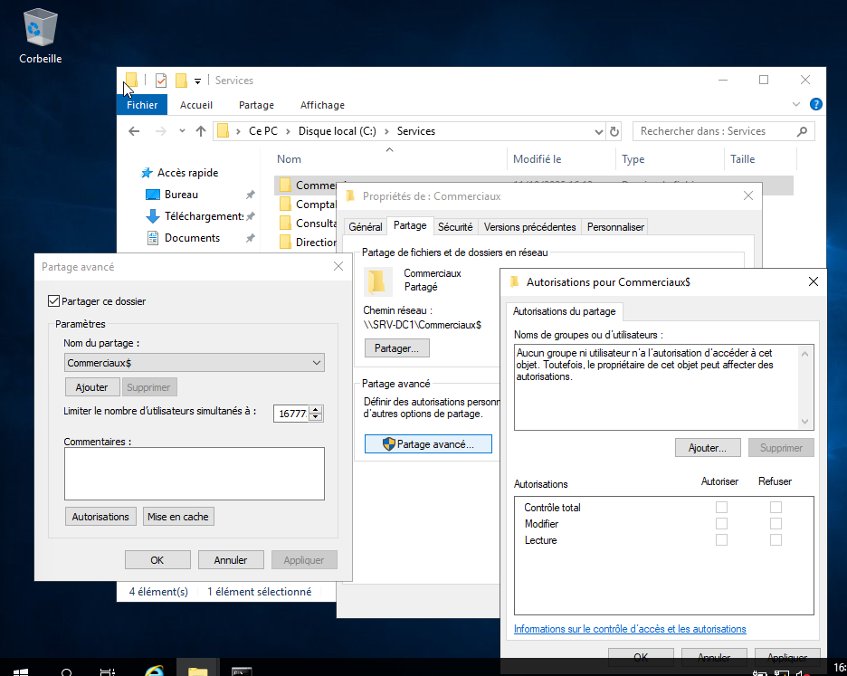

---

## 🔐 6. Gestion de la sécurité et de l’héritage

Lors de la configuration NTFS, un message d’erreur est apparu concernant l’héritage.
Celui-ci provenait du dossier parent `C:\Services`.
La solution a été de :

1. Ouvrir **Propriétés → Sécurité → Avancé** ;
2. Cliquer sur **“Désactiver l’héritage”** ;
3. Choisir **“Convertir les autorisations héritées en autorisations explicites”**.


---

## ✅ 7. Bilan

L’infrastructure Windows Server 2019 est désormais pleinement opérationnelle :

- Domaine **rue25.com** fonctionnel ;
- Rôle DHCP actif et distribuant correctement les IP ;
- Active Directory structuré par services ;
- Dossiers partagés sécurisés selon la politique d’accès.

Ce travail a permis de voir à nouveau ou de consolider les compétences suivantes :

- Installation et gestion des rôles Windows Server ;
- Configuration d’un domaine Active Directory ;
- Administration du DHCP et du DNS ;
- Mise en œuvre de la sécurité NTFS.

---

## 📚 Ressources

- [Documentation Microsoft : DHCP Server 2019](https://learn.microsoft.com/fr-fr/windows-server/networking/technologies/dhcp/dhcp-top)
- [AD DS Administration Guide](https://learn.microsoft.com/fr-fr/windows-server/identity/ad-ds/get-started/virtual-dc/active-directory-domain-services-overview)

---

✍️ _Rédigé et configuré par Théo FRANCOIS — Wild Code School / Simplon Réseaux & Cyber 2025_
