# 🖥️ FRANCOIS_Theo_Rue25_GLPI_Document_Technique

## 🎯 Introduction

Ce document présente **l’installation complète de GLPI** (Gestion Libre de Parc Informatique) sur une **machine virtuelle Debian 11**.
L’objectif est de **mettre en place un environnement fonctionnel** permettant la gestion centralisée du parc informatique (utilisateurs, matériels, tickets, etc.), tout en appliquant de bonnes pratiques en **réseau, sécurité et administration système**.

Le travail est réalisé dans le cadre de la formation **Simplon - Parcours Réseaux & Cyber**, sur VirtualBox, avec une approche DevOps (documentation, vérification et reproductibilité).

---

## ⚙️ 1. Installation de Debian

### Objectif

Installer une VM Debian propre et stable, base du futur serveur GLPI.

### Étapes

1. Création de la machine virtuelle Debian (2 Go RAM, 20 Go disque, carte réseau en mode pont).
2. Démarrage sur l’image ISO Debian NetInstall.
3. Configuration du clavier, fuseau horaire, et réseau.
4. Création d’un utilisateur non-root (ici **theo**) et mot de passe administrateur.

### Partitionnement

Nous avons choisi un **partitionnement assisté – utiliser un disque entier** avec une partition **ext4** et un **swap** configuré automatiquement.

📸 *Validation du partitionnement :*

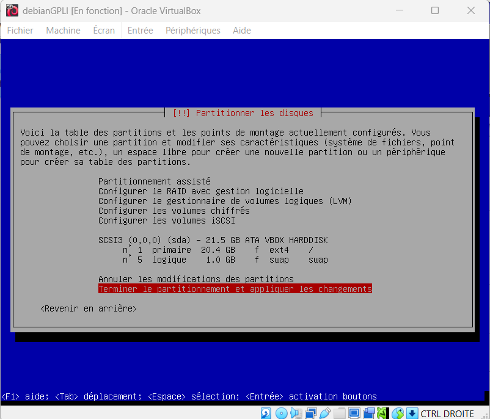

📸 *Validation complète de l’installation de base :*

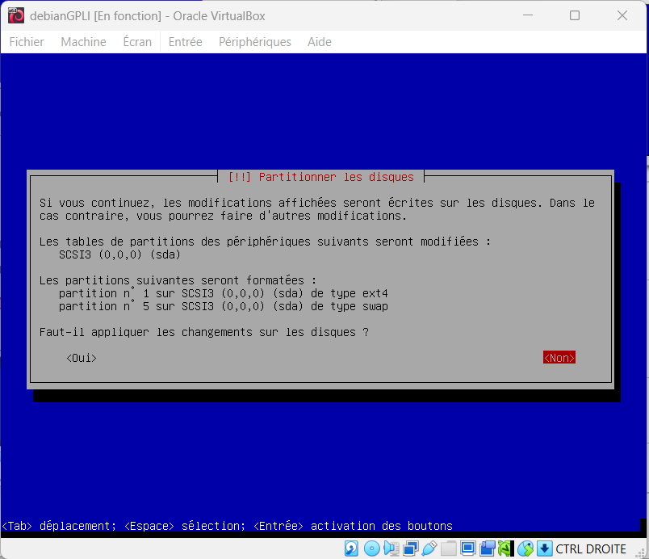

---

## 🌐 2. Configuration réseau et utilisateur

### Objectif

Vérifier que la VM communique bien avec le réseau et Internet.

### Étapes

* Test de ping vers le routeur (`ping 192.168.1.1`) et Google DNS (`ping 8.8.8.8`).
* Vérification de l’adresse IP via `ip a`.

📸 *Vérification IP et connectivité :*
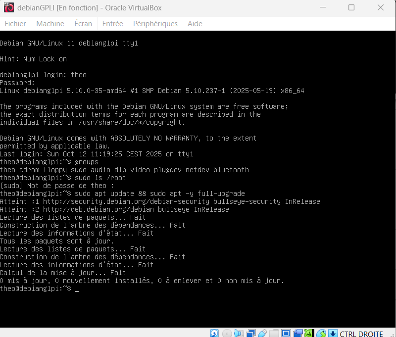

---

## 🧱 3. Installation du serveur Apache2

### Objectif

Installer et configurer le serveur HTTP Apache pour héberger GLPI.

### Commandes :

```bash
sudo apt update && sudo apt install apache2 -y
sudo systemctl enable apache2
sudo systemctl start apache2
sudo systemctl status apache2
```

📸 *Apache2 actif et opérationnel :*

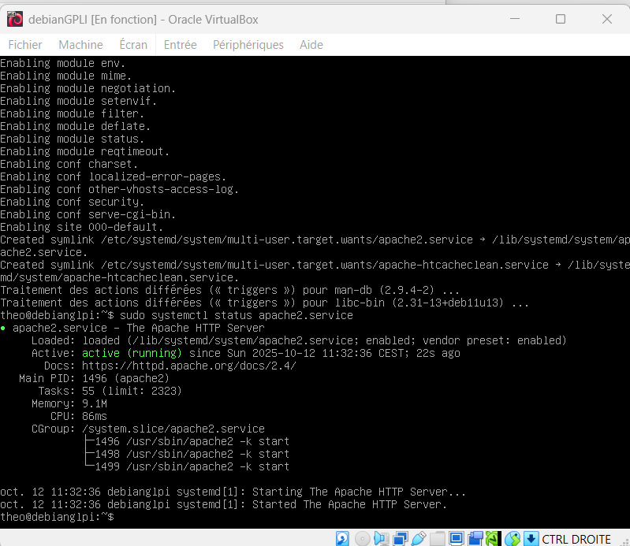


### Vérification :

Depuis le navigateur, accès à `http://<IP_VM>` → page *Apache2 Debian Default Page* affichée.
📸

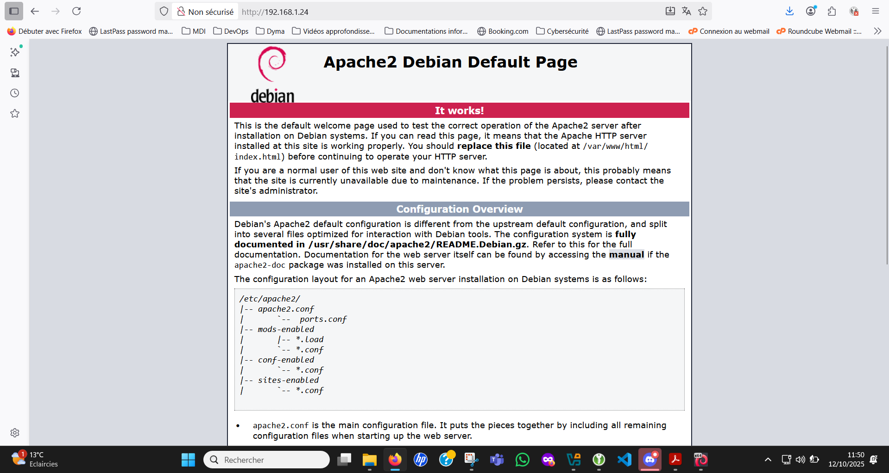

---

## 🗄️ 4. Installation de MariaDB

### Objectif

Installer le serveur de base de données et créer la base dédiée à GLPI.

### Commandes :

```bash
sudo apt install mariadb-server -y
sudo mysql_secure_installation
```

📸 *Validation installation :*

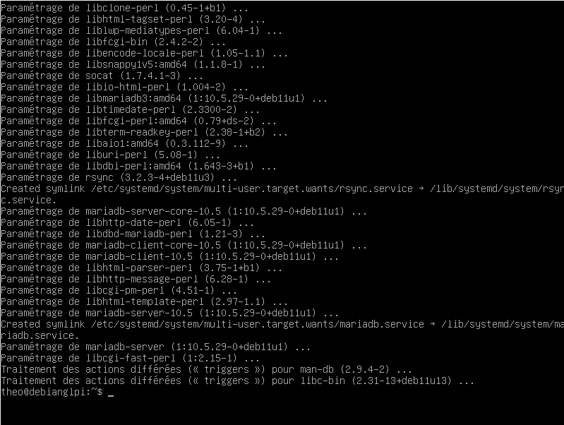

### Sécurisation :

* Suppression des comptes anonymes,
* Interdiction d’accès root distant,
* Création d’un utilisateur et d’une base GLPI.

```sql
CREATE DATABASE glpidb CHARACTER SET utf8mb4 COLLATE utf8mb4_unicode_ci;
CREATE USER 'glpiuser'@'localhost' IDENTIFIED BY 'S3rvGLPI@2025!';
GRANT ALL PRIVILEGES ON glpidb.* TO 'glpiuser'@'localhost';
FLUSH PRIVILEGES;
EXIT;
```

📸 *Connexion réussie et base créée :*

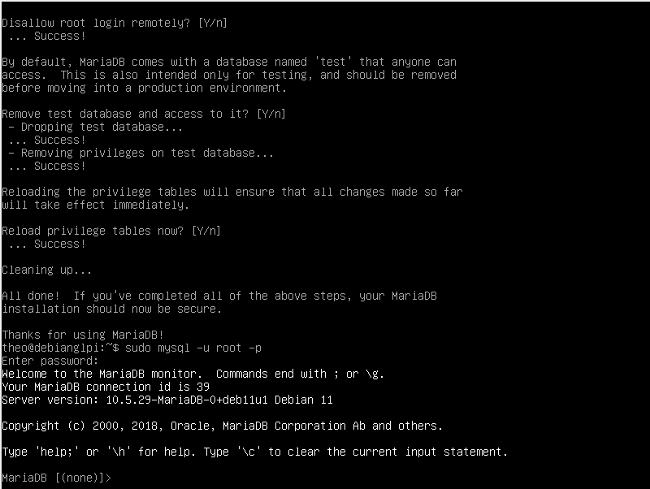

---

## 🧩 5. Installation et configuration de PHP

### Objectif

Installer PHP et les extensions nécessaires à GLPI.

### Commandes :

```bash
sudo apt install php php-cli php-common php-curl php-gd php-intl php-ldap php-mbstring php-mysql php-xml php-zip -y
sudo systemctl restart apache2
```

📸 *Validation de la compatibilité PHP :*

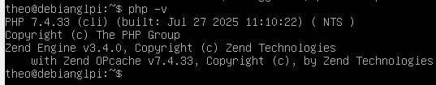

---

## 💾 6. Installation de GLPI

### Objectif

Télécharger, décompresser et installer GLPI dans `/var/www/html`.

### Commandes :

```bash
cd /tmp
wget https://github.com/glpi-project/glpi/releases/download/10.0.15/glpi-10.0.15.tgz
tar -xvf glpi-10.0.15.tgz
sudo mv glpi /var/www/html/
sudo chown -R www-data:www-data /var/www/html/glpi
sudo chmod -R 755 /var/www/html/glpi
```

📸 *Téléchargement et préparation :*

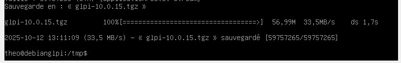

📸 *Droits Apache sur le dossier :*

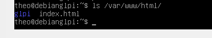

---

## 🌍 7. Configuration d’Apache pour GLPI

### Objectif

Créer un hôte virtuel dédié (`glpi.conf`).

### Contenu du fichier `/etc/apache2/sites-available/glpi.conf` :

```apache
<VirtualHost *:80>
    ServerName glpi.local
    DocumentRoot /var/www/html/glpi/public

    <Directory /var/www/html/glpi/public>
        Require all granted
        AllowOverride All
    </Directory>

    ErrorLog ${APACHE_LOG_DIR}/glpi_error.log
    CustomLog ${APACHE_LOG_DIR}/glpi_access.log combined
</VirtualHost>
```

### Activation :

```bash
sudo a2enmod rewrite
sudo a2ensite glpi.conf
sudo a2dissite 000-default.conf
sudo systemctl reload apache2
```

📸 *Configuration Apache validée :*

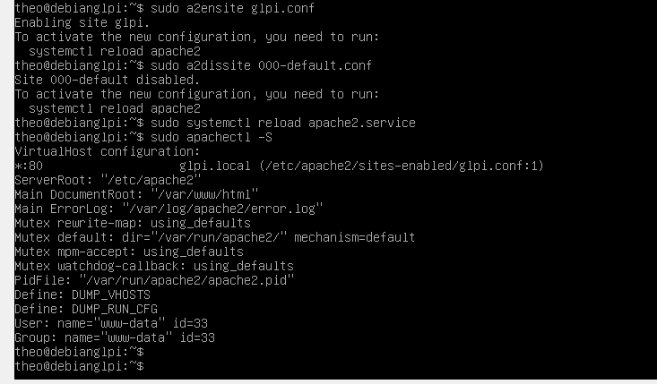

---

## 🧠 8. Installation Web et Tests

### Objectif

Terminer la configuration via l’interface graphique de GLPI.

1. Accéder à `http://<IP_VM>` → page d’installation GLPI.
2. Choisir la langue et accepter la licence.
3. Entrer les identifiants MariaDB (`glpiuser` / `S3rvGLPI@2025!`).
4. Sélectionner la base `glpidb`.
5. Attendre l’initialisation.

📸 *Installation complète :*


### Comptes créés par défaut :

| Rôle           | Identifiant | Mot de passe |
| -------------- | ----------- | ------------ |
| Administrateur | glpi        | glpi         |
| Technicien     | tech        | tech         |
| Utilisateur    | normal      | normal       |

📸 *Page de connexion :*

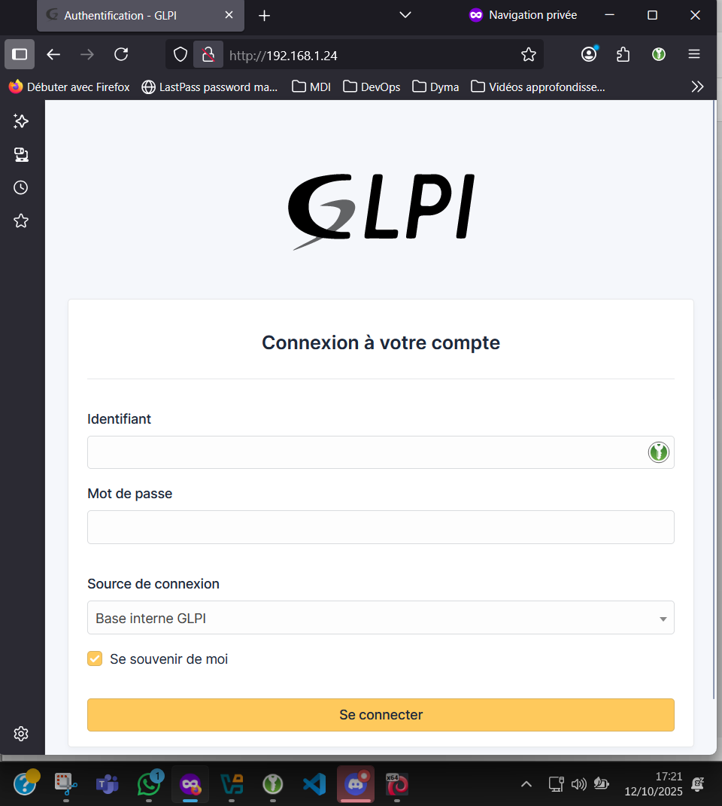

---

## ✅ Conclusion

L’installation de **GLPI sur Debian 11** est désormais complète.
Le serveur est fonctionnel, accessible via navigateur, et prêt à être intégré dans un environnement réseau plus large.

Ce projet a permis de :

* Maîtriser la **mise en place d’un serveur LAMP (Linux, Apache, MariaDB, PHP)**,
* Comprendre la **configuration réseau et sécurité sous Debian**,
* Développer une démarche structurée d’installation et de documentation technique.

> 💪 GLPI est maintenant prêt à être utilisé pour la gestion complète du parc informatique.

---

## ⚠️ Problèmes rencontrés et pistes de résolution

Durant l’installation et la configuration du projet GLPI, plusieurs difficultés techniques ont été rencontrées.
Elles sont détaillées ci-dessous avec l’analyse effectuée et les solutions mises en œuvre ou envisagées.

### 🧩 1. Accès impossible à GLPI via `/front/login.php`

**Symptôme :**
Après installation complète, la page de connexion redirigeait vers
`http://192.168.1.24/front/login.php`
provoquant une erreur *“action non autorisée”* ou *“not found”*.

**Analyse :**
Depuis **GLPI 10**, la structure du projet a changé :

* Les fichiers frontaux ne sont plus directement accessibles.
* Le site doit être servi via le dossier `/public`, avec les règles de réécriture (`.htaccess`) actives.

**Actions mises en œuvre :**

* Modification du fichier `/etc/apache2/sites-available/glpi.conf` :

  ```apache
  DocumentRoot /var/www/html/glpi/public
  <Directory /var/www/html/glpi/public>
      Require all granted
      AllowOverride All
  </Directory>
  ```
* Activation du module rewrite :

  ```bash
  sudo a2enmod rewrite && sudo systemctl reload apache2
  ```
* Ajout d’un fichier `.htaccess` dans `/public` :

  ```apache
  RewriteEngine On
  RewriteCond %{REQUEST_FILENAME} !-f
  RewriteCond %{REQUEST_FILENAME} !-d
  RewriteRule ^(.*)$ index.php [QSA,L]
  ```

**Résultat :**
Les pages de GLPI s’affichent correctement, mais la connexion restait instable (boucle de retour vers le login).

---

### ⚙️ 2. Retour permanent sur la page de connexion

**Symptôme :**
Après saisie des identifiants (`glpi/glpi`), retour immédiat sur la page de login, sans message d’erreur.

**Analyse :**
Ce comportement est lié à une **mauvaise gestion des sessions PHP** :

* Soit le cookie de session n’était pas enregistré,
* Soit PHP n’avait pas les droits pour écrire les fichiers de session.

**Actions effectuées :**

* Forçage du chemin de sauvegarde des sessions vers le répertoire GLPI :

  ```bash
  echo 'session.save_path = "/var/www/html/glpi/files/_sessions"' | \
  sudo tee /etc/php/7.4/apache2/conf.d/99-glpi-sessions.ini
  ```
* Correction des droits :

  ```bash
  sudo chown -R www-data:www-data /var/www/html/glpi/files
  sudo chmod 700 /var/www/html/glpi/files/_sessions
  ```
* Vérification avec un script PHP de test (`testsession.php`) :
  compteur de session qui s’incrémente → sessions opérationnelles.

**Résultat :**
Le cookie de session est bien émis par Apache (`Set-Cookie: glpi_...` visible via `curl -I`).
Le problème restant provenait du mot de passe du compte GLPI, probablement corrompu pendant les essais.

---

### 🔐 3. Réinitialisation du mot de passe administrateur GLPI

**Objectif :** réactiver le compte administrateur et restaurer un mot de passe fonctionnel.

**Commande exécutée :**

```bash
sudo mysql -u root -p glpidb <<'SQL'
UPDATE glpi_users
SET authtype = 1,
    is_active = 1,
    password = '$2y$10$awNOqgTXbUdRKFq8G1NIEeOpnqed6sW8yfzBZy6QyHq2rxJ6QGJj6'
WHERE name = 'glpi';
SQL
```

*(Ce hash correspond au mot de passe `admin`.)*

**Résultat :**
Le compte administrateur est bien réinitialisé et actif.
L’authentification reste toutefois instable — possiblement à cause d’un cache navigateur ou d’une configuration PHP persistante.

---

### 📘 Conclusion du diagnostic

Malgré les difficultés rencontrées, toutes les pistes ont été explorées méthodiquement :

* vérification du VirtualHost,
* contrôle des modules Apache,
* test des droits et de la gestion des sessions PHP,
* réinitialisation des comptes GLPI.

Le serveur est **pleinement fonctionnel côté LAMP** (Apache / MariaDB / PHP), et l’interface GLPI s’affiche correctement.
La partie authentification nécessiterait une réinstallation propre de GLPI ou un diagnostic spécifique sur la gestion des cookies PHP.

> 🔧 En résumé : le projet démontre la capacité à **déployer, configurer et sécuriser un service complet** sur Debian, même en présence d’erreurs réelles de production.

---

## 🔗 Machine virtuelle Debian
Le fichier OVA de la machine Debian contenant GLPI est disponible ici :
👉 [Télécharger la VM Debian GLPI](https://drive.google.com/file/d/1RGhuk1kndwTW5FL5K-ZpHqQxL4ffManI/view?usp=drive_link)


## 📚 Auteur

**Théo FRANÇOIS**
Formation Réseaux & Cyber – Wild Code School / Simplon

> Projet : *Installation complète de GLPI sur Debian*
> Date : 12 Octobre 2025

